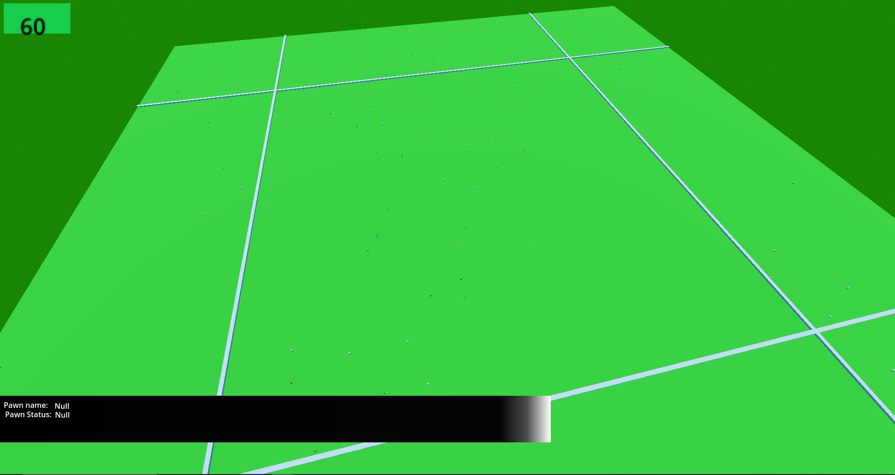

# MEDIEVAL HERO SIM (WORKING TITLE)
Medieval Hero Sim is currenlty am attempt to create an open source game similar to Majesty on the Godot Engine.

    

    

    

    

### Community
Right now it is just me (Sunshine-Dev), but one day I hope there will be an awesome community!
Here is a link to the discord: https://discord.gg/RcvAtQj268

### running
The project currently runs on Godot 4.1.1

To run the project:
	download Godot C# version 4.1.1
	download .NET SDK version 6 or greater

That should be all required to run it. 
For the actual running of the project:
1. Open GodotC# 4.1.1
2. click 'import'
3. navigate to this repository's project.godot file. (located in MedievalHeroSim/Game/project.godot)
4. select the newly imported project and click 'run'

For editing: [CONTRIBUTING.md](docs/CONTRIBUTING.md)

If I missed anything ( and I am sure as hell I did) msg me on discord. 
