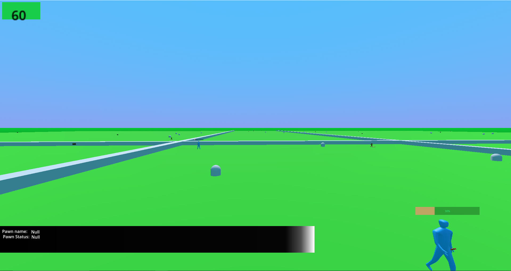
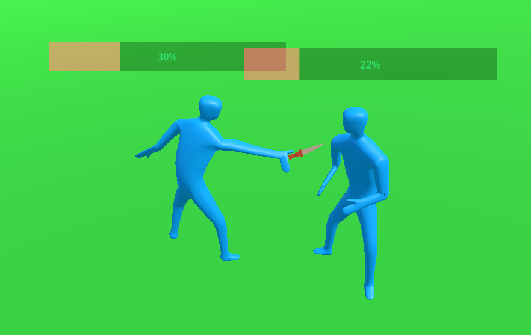
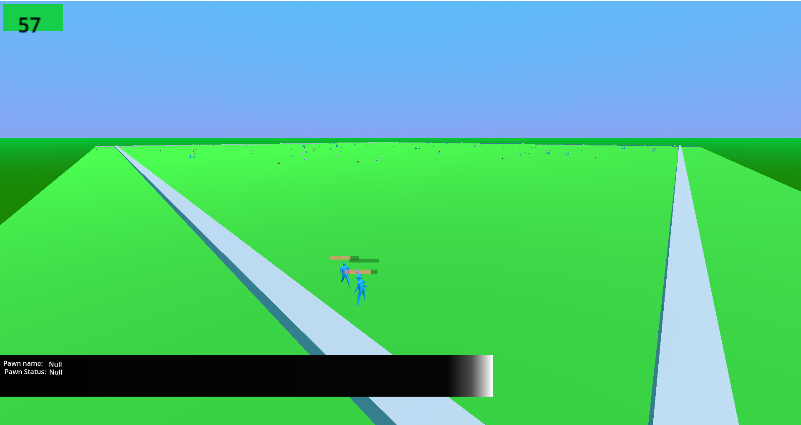

# MEDIEVAL HERO SIM (WORKING TITLE)
Medieval Hero Sim is currenlty am attempt to create an open source game similar to Majesty on the Godot Engine.

    

    

    

    

### Community
Right now it is just me (Sunshine-Dev), but one day I hope there will be an awesome community!
Here is a link to the discord: https://discord.gg/RcvAtQj268

### running
The project currently runs on Godot 4.0.3

To run the project:
	download Godot C# version 4.0.3
	download .NET SDK version 6 or greater

That should be all required to run it

For editing:
install VScode

get exensions:
	Godot Tools	
	C#
	Any Nuget Package Manager

Download the Nuget packages listed in the csproj (they might be installed automatically)

Create a GODOT environment variable that points at the Godot executable

If I missed anything ( and I am sure as hell I did) msg me on discord. 
